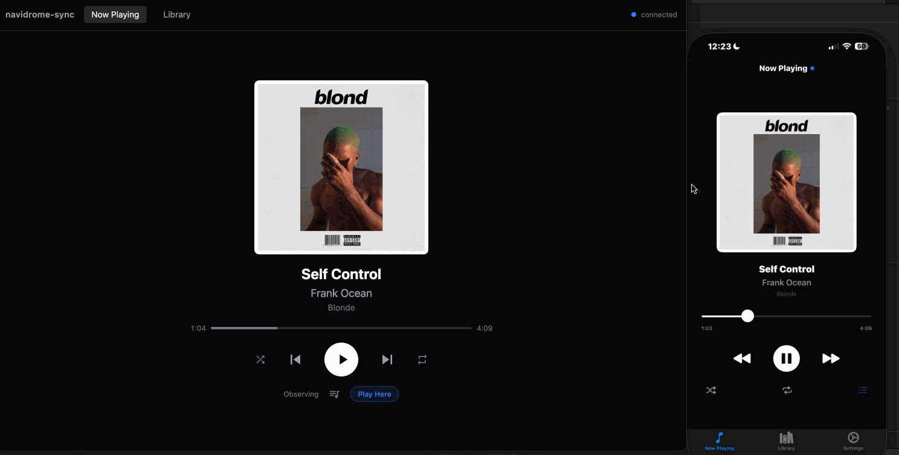

# navidrome-sync

navidrome-sync is a self-hosted cross-client now playing sync ecosystem for Navidrome.

## How It Works
navidrome-sync uses an active/observer client model to synchronize playback state across devices. A real-time WebSocket hub maintains a shared playback state, allowing any client to see what’s playing. Clients can claim playback ownership with a “Play Here” button, instantly transferring active playback. The Go backend sync service polls Navidrome’s `getNowPlaying` endpoint to keep the state up-to-date.

## Architecture Overview
navidrome-sync consists of three components:

1. **Go Backend Sync Service**
   - **Responsibilities**: Polls Navidrome’s `getNowPlaying` endpoint, manages the WebSocket hub, and serves the API.
   - **Tech Stack**: Go, `gorilla/websocket`

2. **React Web Client**
   - **Responsibilities**: Displays the playback state, allows playback control, and provides the “Play Here” functionality.
   - **Tech Stack**: React 19, TypeScript, Vite, Tailwind CSS, Zustand

3. **SwiftUI iOS App**
   - **Responsibilities**: Provides a native iOS interface for playback control and state synchronization.
   - **Tech Stack**: SwiftUI, AVPlayer, URLSessionWebSocketTask

## Prerequisites
- Docker
- Docker Compose v2
- A running Navidrome instance on the same network

## Deployment
1. Create the Docker network:
   ```bash
   docker network create navidrome-net
   ```
2. Configure the `.env` file with the required environment variables (see below).
3. Ensure your `docker-compose.yml` file is configured to use the `navidrome-net` network.
4. Start the services:
   ```bash
   docker compose up --build -d
   ```
5. Ensure the Navidrome instance is also on the `navidrome-net` network.

## Environment Variables
| Name                | Description                              | Example Value            |
|---------------------|------------------------------------------|--------------------------|
| `NAVIDROME_URL`     | URL of the Navidrome instance           | `http://navidrome:4533` |
| `NAVIDROME_USER`    | Username for Navidrome authentication   | `admin`                  |
| `NAVIDROME_PASSWORD`| Password for Navidrome authentication   | `password`               |
| `POLL_INTERVAL_SECS`| Polling interval for `getNowPlaying`    | `5`                      |
| `PORT`              | Port for the sync service               | `8080`                   |

## Demo



## iOS App
The iOS app must be built and run via Xcode. Point the app at the sync service URL on the local network.

## Planned Features
- watchOS companion app
- Offline downloads to iOS and watch
- Playlist management

## Security Note
The `/api/config` endpoint returns Navidrome credentials to the frontend. This is intentional for a LAN-only deployment.